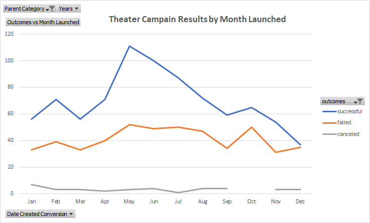
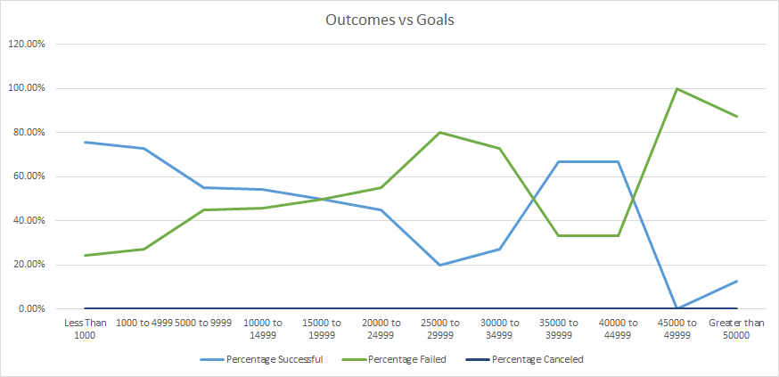

# Overview of Project

## Purpose and Background

  This project was a result of a request from Louise to analyize data from kickstarter campaigns in order to discern the outcomes
of campaigns based on campaign launch dates and campaign goals.

## Analysis and Challenges

### Analysis of Outcomes Based on Launch Date

Using a data set of Kickstarter campaigns, values for campaign date initiation, outcome, and "parent category" was aggregated into a pivot table.
This data was filtered by parent category for "Theater". The results of this filter were further analyzed by filtering the dates of campaign launch
by month of launch. The data was then filtered for outcomes only including the values of "successful", "failed", and "canceled".These results were 
sorted in a decending order for the outcomes value to arrive at the pivot table displaying aggregated counts of campaign outcomes.

A PivotChart was generated from the table and is displayed below:

### Analysis of Outcomes Based on Goals

The initial step of this analysis was to define the ranges over which the various theater campaigns would be analyzed. The ranges were provided in 
increments of $3999 with "less than 1000" acting as a lower bound and "greater than 50000" acting as the upper bound for the analysis set. Once the
bounds were set, the COUNTIFS() function was utilized to filter the Kickstarter data for the desired range, outcome, and campaign catagory. The
desired outcomes for the analysis were limited to "successful", "failed", and "canceled". The desired campaign catagory was set to "plays" for all
ranges. The results from each COUNTIFS() function was aggregated total of events meeting the desired citeria. After analyzing all the outcomes 
dover all of the desired ranges, the totals for each outcome in each range were summed together with the SUM() function. This provided the total 
events for each range.

The percentage of each outcome with in the range was calculated next. The total of each outcome in each of the monitery ranges was divided by the
total number of events in the range. The resulting value was multiplied by 100 to provide a percentage of each outcome within the monetary ranges.
The resulting percentages were then used to generated a plot of campaign outcome vs monertary goal ranges.

The resulting chart is provided below:

### Challenges and Difficulties Encountered

## Results

- What are two conclusions you can draw about the Outcomes based on Launch Date?

- What can you conclude about the Outcomes based on Goals?

- What are some limitations of this dataset?

- What are some other possible tables and/or graphs that we could create?

## References
